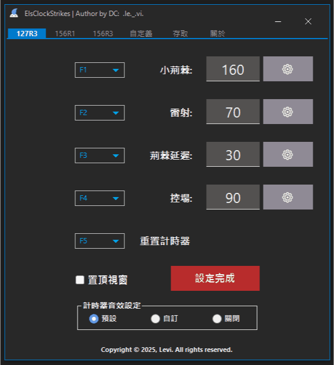

[![Contributors][contributors-shield]][contributors-url]
[![Forks][forks-shield]][forks-url]
[![Stargazers][stars-shield]][stars-url]
[![Issues][issues-shield]][issues-url]
[![MIT License][license-shield]][license-url]
<br />
[![ElsClockStrikes CI MSBuild and Test][CI-Build-shield]][CI-Build-url]
[![ElsClockStrikes CD Only For Date Tags on Master][CD-Build-shield]][CD-Build-url]
[![ElsClockStrikes Downloads][downloads-shield]][downloads-url]

<!-- PROJECT LOGO -->
<br />
<div align="center">
  <a href="https://github.com/Neillife/ElsClockStrikes">
    
  </a>

  <h3 align="center">ElsClockStrikes</h3>

  <p align="center">
    為 Elsword TW 自定義你的副本計時器
    <br />
    <br />
    <a href="https://github.com/Neillife/ElsClockStrikes/README.md">中文</a>
    <!--·
    <a href="https://github.com/Neillife/ElsClockStrikes/README_en.md">English</a>-->
  </p>
</div>


<!-- 目錄 -->
<details>
  <summary>目錄</summary>
  <ol>
    <li><a href="#關於">關於</a></li>
    <li><a href="#如何使用">如何使用</a></li>
    <li><a href="#功能">功能</a></li>
	<li><a href="#程式介面">程式介面</a></li>
    <li><a href="#待新增">待新增</a></li>
    <li><a href="#資料夾說明">資料夾說明</a></li>
    <li><a href="#專案-library">專案 Library</a></li>
    <li><a href="#如何提交-pr">如何提交 PR</a></li>
    <li><a href="#免責聲明">免責聲明</a></li>
    <li><a href="#貢獻者">貢獻者</a></li>
  </ol>
</details>

# 關於

在我使用一些現有的計時器應用程式時，我發現它們的功能都是預先設定好的，無法根據個人需求進行自定義。這樣的限制讓我覺得不太好用，因此我決定自己開發一個更加靈活的計時器應用程式。

本專案的計時器應用程式允許使用者自定義秒數和快捷鍵功能以及音效提醒，提供了極大的便利和靈活性，如果在使用過程中遇到任何問題，或者有任何功能需求歡迎發 [issues](https://github.com/Neillife/ElsClockStrikes/issues)。

我也非常歡迎大家向我的專案提交 [Pull Requests](https://github.com/Neillife/ElsClockStrikes/pulls)，共同完善這個應用程式，希望這個計時器應用程式能夠幫助到你，並期待你的反饋和貢獻！

# 如何使用

1. 訪問 [Release](https://github.com/Neillife/ElsClockStrikes/releases)
2. 根據 Tag 下載最新版本的檔案 (Tag 命名方式為版本發布時的日期，請選擇離當下日期最近的 Tag 進行下載，或是在 Tag 標題中找到 Latest 字樣。)
3. 找到 Assets > 點擊檔案名稱為 ```ElsClockStrikes.zip``` 下載應用程式

# 功能

- [x] 自定義按鍵觸發計時
- [x] 自定義計時秒數
- [x] 自定義音效提醒
- [X] 自定義音量調整
- [x] 自定義計時器視窗分離
- [x] 127R3 機制計時
- [x] 156R1 機制計時
- [x] 156R3 機制計時
- [x] 完全自定義計時器
- [x] 完全自定義稱號計時器
- [x] 儲存設定/讀取設定
- [x] 自動檢查更新

# 程式介面

<details>
  <summary>滑鼠點擊觀看</summary>
    <a href="https://github.com/Neillife/ElsClockStrikes">
      
    </a>
</details>

# 資料夾說明

- ElsClockStrikes
  - Core - 各項自定義主要功能
  - DllImport - 元件
  - Forms - UI 介面
  - Properties - vs2022 預設
  - Resources - 音效及其他資源檔
- images - README 素材
- packages - 專案使用 packages

# 專案 Library

- [NAudio v2.2.1](https://github.com/naudio/NAudio)
- [MouseKeyHook v5.7.1](https://github.com/gmamaladze/globalmousekeyhook)
- [INI-Parser v2.5.2](https://github.com/rickyah/ini-parser)
- [xUnit v2.9.3](https://github.com/xunit/xunit)
- [xUnit.StaFact v1.2.69](https://github.com/AArnott/Xunit.StaFact)
- 一些 Forms 元件 Lib 取得來源為網路上
  - Guna.UI v1.9.0
  - MetroSuite v2.0
  - Siticone.UI v1.0.3

# 如何提交 PR

如果您有更好的建議或想法，請 Fork 本 Repo 並建立 [PR](https://github.com/Neillife/ElsClockStrikes/pulls)，您也可以簡單的使用 ```enhancement``` Tag 來開啟 [issues](https://github.com/Neillife/ElsClockStrikes/issues)，我會非常歡迎您所做的任何貢獻，請不要吝嗇點下你的 Start。

1. Fork Repo
2. 建立您的 Branch 功能 ```git checkout -b feature/FeatureName```
3. 提交您的更改 ```git commit -m "Your commit message"```
4. 推送到遠端 Branch ```git push origin feature/FeatureName```
5. 打開 [Pull Request](https://github.com/Neillife/ElsClockStrikes/pulls)

# 免責聲明

**本工具僅作為```手動觸發```的計時工具，不具備任何自動化功能，不涉及遊戲記憶體修改也不干涉遊戲正常運作。**  
**專案使用的各項 Library 以及其他有的沒的，一切僅供用於學術研究目的，這僅僅是我個人的項目，請不要以任何理由起訴我。**

# 貢獻者

感謝所有為本項目做出貢獻的開發者們

<a href="https://github.com/Neillife/ElsClockStrikes/graphs/contributors">

</a>


[contributors-shield]: https://img.shields.io/github/contributors/Neillife/ElsClockStrikes.svg?style=for-the-badge
[contributors-url]: https://github.com/Neillife/ElsClockStrikes/graphs/contributors
[forks-shield]: https://img.shields.io/github/forks/Neillife/ElsClockStrikes.svg?style=for-the-badge
[forks-url]: https://github.com/Neillife/ElsClockStrikes/network/members
[stars-shield]: https://img.shields.io/github/stars/Neillife/ElsClockStrikes.svg?style=for-the-badge
[stars-url]: https://github.com/Neillife/ElsClockStrikes/stargazers
[issues-shield]: https://img.shields.io/github/issues/Neillife/ElsClockStrikes.svg?style=for-the-badge
[issues-url]: https://github.com/Neillife/ElsClockStrikes/issues
[license-shield]: https://img.shields.io/github/license/Neillife/ElsClockStrikes.svg?style=for-the-badge
[license-url]: https://github.com/Neillife/ElsClockStrikes/blob/master/LICENSE
[CI-Build-shield]: https://img.shields.io/github/actions/workflow/status/Neillife/ElsClockStrikes/msbuild-test-ci.yml?style=for-the-badge&branch=master&label=CI%20BUILD
[CI-Build-url]: https://github.com/Neillife/ElsClockStrikes/blob/master/.github/workflows/msbuild-test-ci.yml
[CD-Build-shield]: https://img.shields.io/github/actions/workflow/status/Neillife/ElsClockStrikes/release-assets.yml?style=for-the-badge&label=CD%20BUILD
[CD-Build-url]: https://github.com/Neillife/ElsClockStrikes/blob/master/.github/workflows/release-assets.yml
[downloads-shield]: https://img.shields.io/github/downloads/Neillife/ElsClockStrikes/total?style=for-the-badge
[downloads-url]: https://github.com/Neillife/ElsClockStrikes/releases